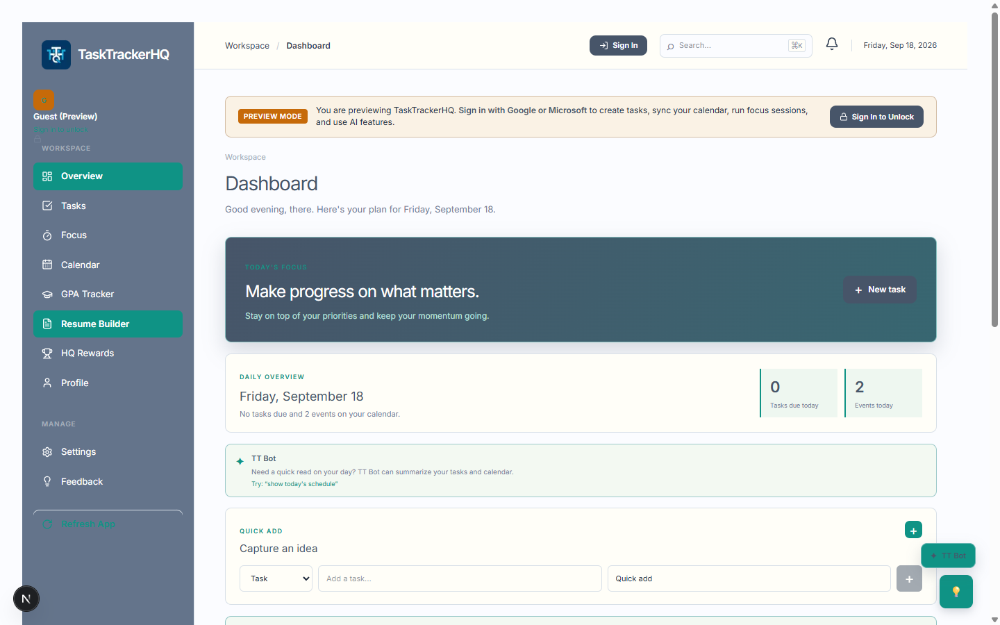
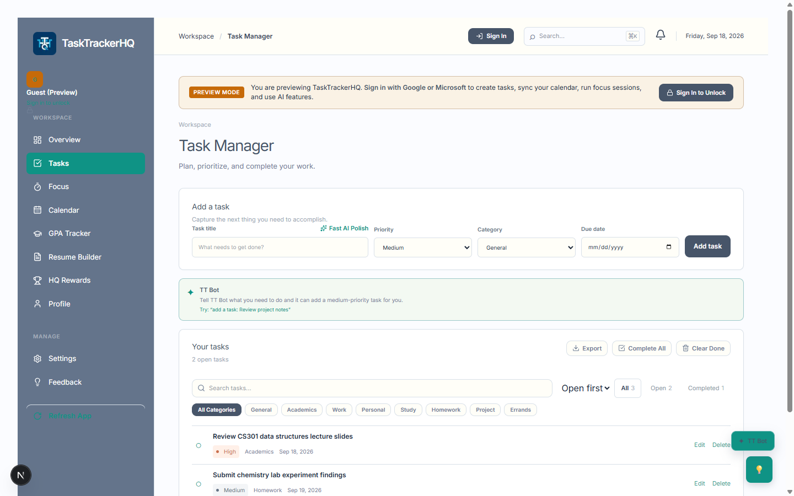
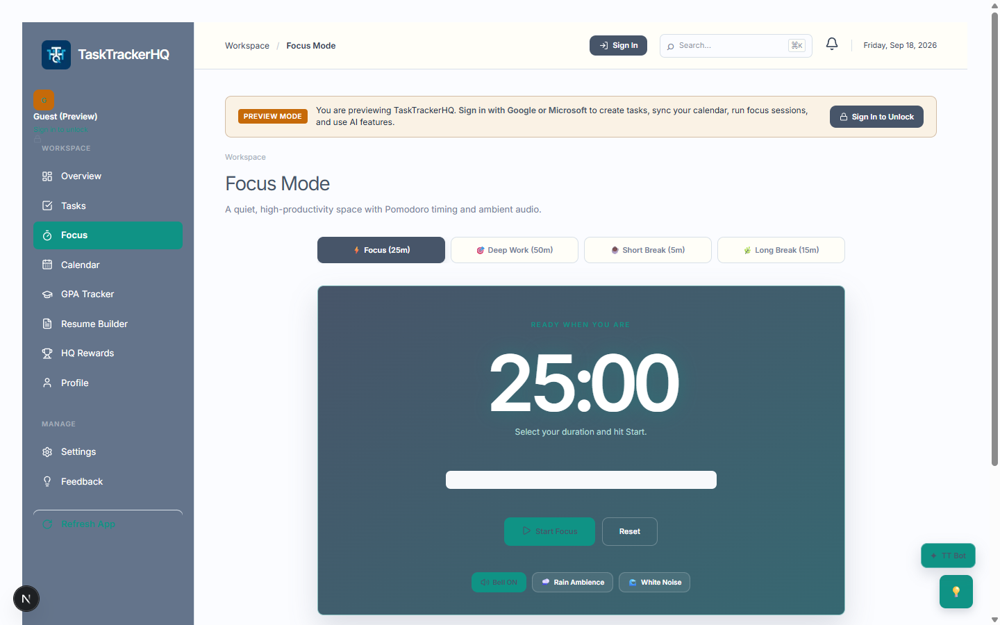
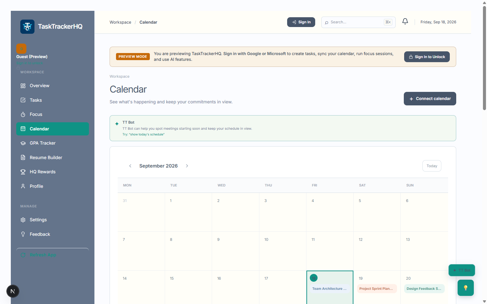
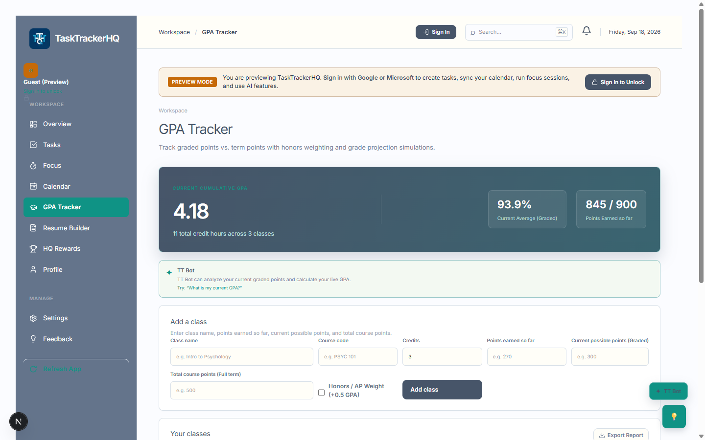
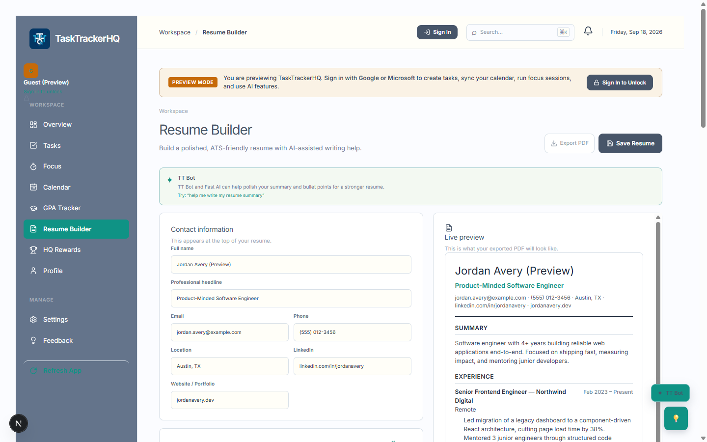
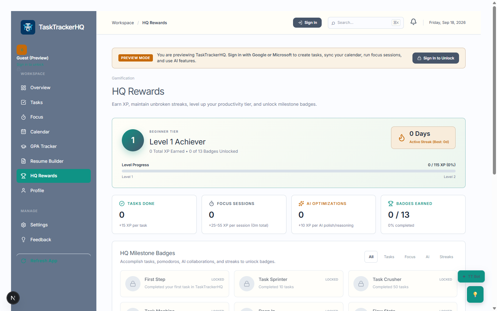
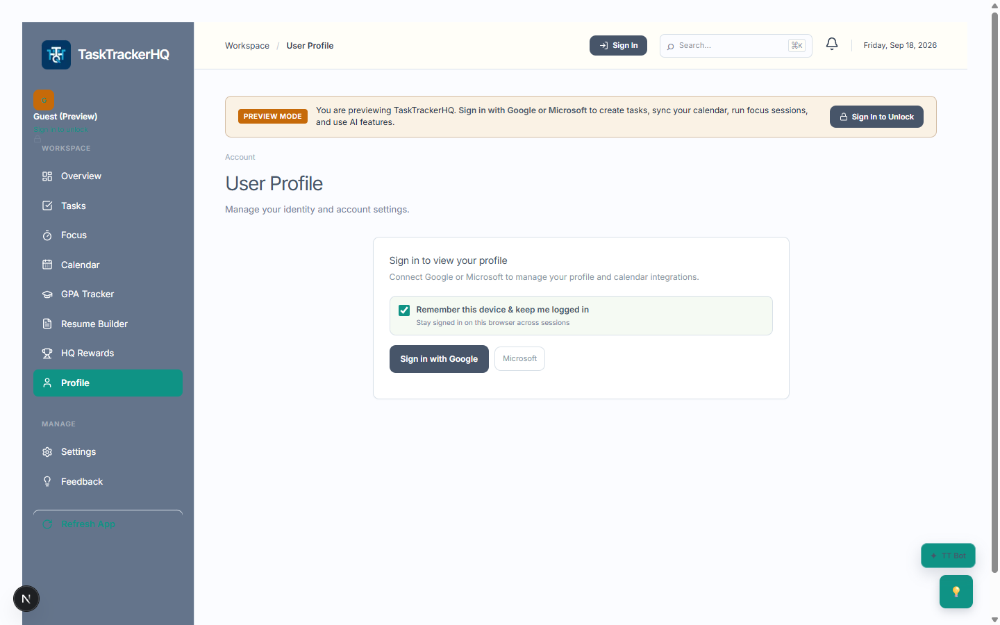
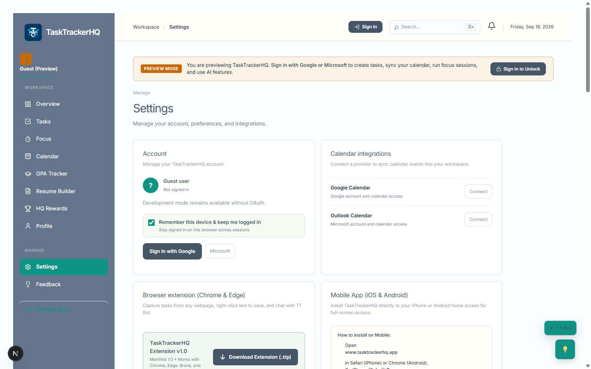

# TaskTrackerHQ — Features List

A productivity workspace for tasks, focus time, calendar, academics, and career tools — backed by an AI copilot, gamified rewards, and real-time sync across devices.

## Dashboard / Overview

- Personalized greeting and daily plan summary
- Quick-add for new tasks directly from the dashboard
- Task progress snapshot and completion stats
- Upcoming calendar events preview
- HQ Rewards snapshot (level, XP, tier, streak)
- Focus streak visibility
- TT Bot hint for day summaries and planning suggestions
- Live cross-tab refresh of dashboard data
- Guest preview mode with demo content

## Tasks

- Create, edit, complete, reopen, and delete tasks
- Priority levels: Low / Medium / High
- Categories, including custom categories
- Due dates
- Search and filter by status/category
- Sorting
- AI-assisted task title polishing
- Alerts for tasks due today or overdue
- Guest demo tasks preview
- Live sync across tabs/devices

## Focus (Pomodoro Timer)

- Pomodoro-style focus timer
- Short break and long break modes
- Custom timer length
- Start, pause, and reset controls
- Optional task selection to focus on
- Session stats: sessions completed and total minutes
- Streak tracking across sessions
- Completion sound
- Ambient sound options (rain / noise / off)
- Syncs focus stats across tabs/devices

## Calendar

- Month calendar view plus event list
- Create, edit, and manage events
- Event reminders
- Repeat schedules: none / daily / weekly / monthly, with an end date
- Google Calendar sync for connected events
- Merges Google/Microsoft/local events
- Upcoming event reminders/alerts
- Live sync across tabs/devices
- Guest demo calendar preview

## GPA Tracker

- Add, edit, and delete classes
- Track credits and points earned vs. possible
- Honors class GPA boost support
- Letter grade calculation
- GPA/grade projection tracking
- Auth-gated save/edit actions
- Local + server merge with sync
- Guest GPA preview demo
- Save/delete confirmation notifications

## Resume Builder

- Structured resume profile builder
- Contact info, professional summary, experience, education, skills, and projects sections
- Add/remove experience entries and bullet points
- Add/remove education and project entries
- AI-assisted polishing for the summary and individual bullet points
- Live preview pane showing exactly what the exported PDF will look like
- Export to PDF (print-optimized layout that supports multi-page resumes)
- Draft auto-save to local storage, protecting in-progress edits from being overwritten by background sync
- Auth-gated Save and Export actions
- Guest demo resume preview

## HQ Rewards

- XP and level progression
- Productivity tier display (Beginner → Intermediate → Advanced → Productivity Master)
- Active streak and best streak tracking
- XP progress bar toward next level
- Task completion stats
- Focus session stats
- AI usage stats
- Badge collection with locked/unlocked states (e.g. "Task Machine," "Focus Pro," "AI Power User," "Consistency King")
- Badge filtering by category
- Live refresh across tabs/devices

## Profile

- View signed-in identity details
- Connected sign-in provider display (Google/Microsoft)
- Rewards summary in profile
- Reconnect/disconnect account actions
- Theme customization access
- Account deletion
- Guest sign-in prompt for profile access

## Settings

- Sign in / sign out account controls
- Google Calendar and Outlook Calendar connection controls
- Admin portal entry points (for admin accounts)
- AI usage widget
- Notification preferences
- Theme customization
- Browser extension download/install guidance
- Mobile app (PWA) install guidance
- Legal/compliance links (Terms, Privacy)

## Admin Tools
- AI usage analytics dashboard (by user, model, and feature)
- Cost, token, and request tracking
- Feature toggles for TT Bot / Fast AI / Advanced AI / analysis tools
- User ban/unban controls
- Reset user AI usage
- Update per-user AI tier limits
- Search/filter AI users and abuse flags
- Feedback and suggestion moderation (approve/reject/delete)
- TT Bot-generated summaries of new admin suggestions

## TT Bot (AI Assistant)
- In-app conversational helper for planning and productivity
- Add tasks from chat
- Add calendar events from chat
- Summarize today's schedule and tasks
- Jump to Focus mode from chat
- Jump to GPA Tracker from chat
- Summarize new suggestions for admins
- General productivity Q&A

## AI Tiers: Fast vs. Advanced
- Fast AI for quick rewrites, short edits, and concise assistance
- Advanced AI for deeper reasoning and planning
- On-device AI fallback when supported by the browser
- Cloud fallback when local AI isn't available
- Usage tracking with XP rewards for AI-assisted actions
- Rate-limited access based on account tier

## Accounts & Access
- Sign in with Google
- Sign in with Microsoft
- Guest/preview exploration mode (browse and try the app without an account)
- Account-required modal explaining what signing in unlocks
- Calendar-linked OAuth scopes for calendar sync features
- Admin role detection via allow-listed accounts
- Session-based identity and provider persistence

## Progressive Web App (PWA)
- Installable on mobile home screens and desktops
- Offline-capable caching for static assets and pages
- Automatic update detection with one-tap refresh
- Manual "Refresh App" control

## Notifications
- In-app toast notifications (success/info/warning/error)
- Selectable notification tones (chime, bell, pop, gentle, marimba, or silent)
- Silent mode toggle
- Sound preview/test button
- Read/unread tracking with unread count badge
- Persistent sound preferences

## Cross-Tab & Multi-Device Sync
- Live sync across open tabs, windows, and PWA instances
- Automatic broadcast of updates when any data changes
- Storage-event fallback sync for older browsers
- Refresh-on-focus / visibility-change / pageshow syncing
- Debounced refresh handling to avoid redundant network calls
- Applies to tasks, events, rewards, GPA, resume, and focus data
